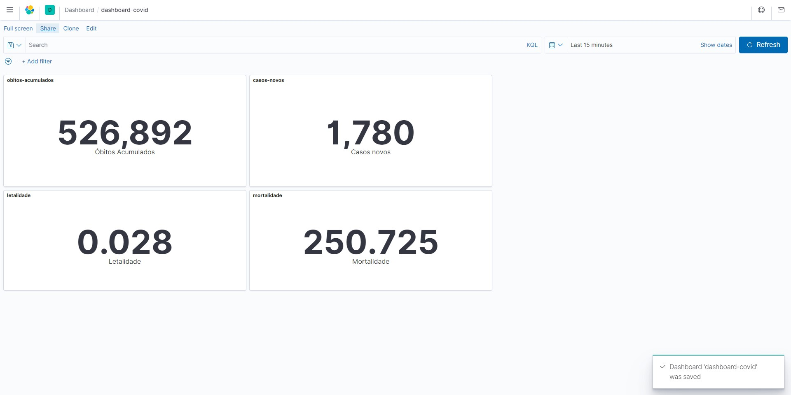

# Projeto final da trilha de Engenharia de Dados da Semantix

## 🛠️ Pré-Requisitos

Garanta que a variável `vm.max_map_count` em `/etc/sysctl.conf` esteja igual a `262144` para o bom funcionamento do Elastic.
```bash
sudo sysctl -w vm.max_map_count=262144
```

## 🚀 Executar o ambiente
Na raiz do projeto, inicie os serviços com o docker compose:
```bash
docker-compose up -d
```

**Na primeira vez que instanciar os serviços**, execute o script de preparação do ambiente:
```bash
sh prepare-environment.sh
```

Para parar os serviços, utilize:
```bash
docker-compose stop
```

Para iniciar os serviços, utilize:
```bash
docker-compose start
```

Para acessar o jupyter notebook, utilize a url: [http://localhost:8889](http://localhost:8889)

## 🦄 Desenvolvimento e Resultados
>Obs: Era de interesse desenvolver o projeto utilizando structured streaming e dar mais atenção para a estética dos resultados, assim como melhor automatizar os processos. Por contratempos da vida, não consegui tempo para terminar o projeto como gostaria até 08/08/2022 (prazo final). Porém como foi de grande aproveitamento, resolvi publicar mesmo assim. Quem sabe um dia saia algo mais interessante daqui :wink:.

Todo o projeto foi desenvolvido através do jupyter notebook [semantix-projeto-covid19.ipynb](data/notebooks/semantix-projeto-covid19.ipynb), a qual possui todo fluxo de execução e resultados.

Foi utilizado o tópico `covid19-obitos` do Kafka como entrada para o Logstash ([logstash.conf](pipeline/logstash.conf)), tendo como resultado de **Óbitos Confirmados** o seguinte Dashboard:



O arquivo de importação do dashboard acima se encontra em [input/dashboard_covidbr/export.ndjson](input/dashboard_covidbr/export.ndjson).

### Scripts de apoio
Foram criados alguns scripts para apoiar a preparação do ambiente e realizar testes, são eles:

|Script|Descrição|
|---|---|
|scripts/create-hive-database.sh|Cria o banco de dados `painel_covidbr` no hive-server|
|scripts/create-kafka-topic.sh|Cria o tópico `covid19-obitos` no kafka|
|scripts/fix-spark-dependencies.sh|Adiciona a dependência `parquet-hadoop-bundle-1.6.0.jar` jupyter|
|scripts/input-to-hdfs|Copia os arquivos de `input/hist_painel_covidbr` para o HDFS|
|prepare-environment.sh|Executa todos os cripts acima, em série, na primeira vez que os containers são instanciados|
|scripts/test-kafka-consumer.sh|Cria um console consumer para exibir as informações do tópico `covid19-obitos`|

Este repositório é um fork de [rodrigo-reboucas](https://github.com/rodrigo-reboucas/docker-bigdata)
